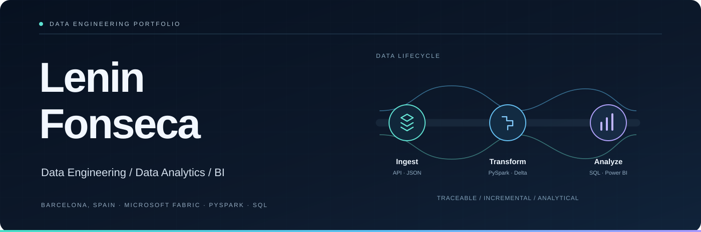
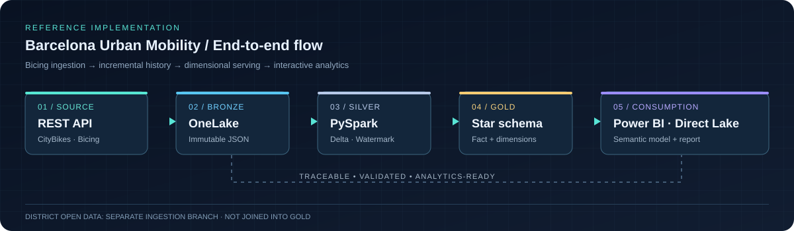

<!--
  Profile design V3. Versions README.md and README-v2.md are preserved.
  SVG assets are vector illustrations written as code, not generated raster images.
-->

 

 

## 01 — Featured project

### Barcelona Urban Mobility Data Platform

A Microsoft Fabric data platform built using public Barcelona Bicing station availability data. It captures API snapshots, maintains incremental historical records, models data for analytical querying, and provides a Power BI reporting layer.

 

<table>
<tr>
<td width="33%" valign="top">
<strong>THE PROBLEM</strong>

Public mobility data changes continuously. A single API response isn't enough to study station availability over time.

</td>
<td width="33%" valign="top">
<strong>THE SOLUTION</strong>

Immutable Bronze snapshots, incremental historical processing in Silver, validation rules and a Gold dimensional model.

</td>
<td width="34%" valign="top">
<strong>THE OUTCOME</strong>

Query-ready Delta tables, a SQL Analytics Endpoint and an interactive Power BI report with analytical KPIs.

</td>
</tr>
</table>

## 02 — Data platform architecture

The system ingests timestamped JSON snapshots into OneLake Bronze. PySpark processes previously unseen snapshots into Delta-based Silver history; the Gold layer exposes a dimensional model for SQL analysis and Power BI.

The Barcelona district dataset is managed as a separate ingestion branch and is not joined into the Gold model.

## 03 — Technical stack

**Languages and development**

 

&nbsp;
&nbsp;
&nbsp;
&nbsp;
&nbsp;
&nbsp;

  

**Data platforms and analytics**

 

&nbsp;
&nbsp;
&nbsp;
&nbsp;

 

| Data engineering | Data analytics and BI |
| :-- | :-- |
| API and JSON ingestion | Analytical SQL |
| Data Factory pipelines | Star schema design |
| Bronze / Silver / Gold architecture | Fact and dimension tables |
| Incremental processing and watermarks | Power BI semantic models |
| Delta MERGE and idempotency | DAX measures and KPI calculations |
| Data validation and error handling | Interactive reporting |

## 04 — Engineering implementation

<strong>Incremental processing and idempotency</strong>

The Silver notebook processes new Bronze snapshots identified through watermark logic. An insert-only Delta MERGE keyed by station and capture timestamp prevents duplicate historical observations during reruns.

<strong>Data validation</strong>

Critical validations stop invalid processing. Non-critical anomalies in source availability breakdowns are retained and flagged instead of silently corrected.

<strong>Dimensional modeling</strong>

The Gold layer includes an availability fact table and station, date, and time dimensions. This model supports SQL querying and Power BI calculations.

<strong>Recovery and operational considerations</strong>

The project documents timestamp parsing, changes in station counts, and capacity throttling. Safe manual reruns support recovery of pending snapshots; automated recovery is not claimed.

## 05 — Certification and contact

**Microsoft Certified: Azure Data Fundamentals**  
`DP-900` · Azure data concepts and services

